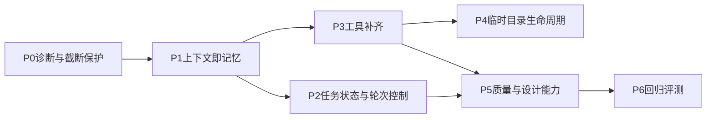

> 规划原稿（2026-10-03）。落地记录见 [plan27.0.md](plan27.0.md)。

# agent_in harness 优化规划

## 一句话结论

PI 和 agent_in 用的都是 DeepSeek 4.1 flash。PI 26 分钟一次做完，产出 13 张表、看板、审计日志；agent_in 同日尝试 4 次，撞了 80 轮上限，拆分质量最差。**同模型、不同结果，说明差距在 harness。** 80 轮不够只是症状，根因是 agent_in 每次请求只带最近约 20K token。更早的历史被压成"只有工具名"的摘要，模型只能反复重读：`build_db.py` 读了 22 次，上一次尝试中 `api.py` 读了 49 次。

---

## 一、对比结论

### 1. 需求理解（以 Excel 实际结构为基准）

基准情况：只有 1 个 sheet，第 2 行是表头。"AC3"指 AC 列从第 3 行起的数据，固定为三段式，共 6 种异常变体。AD 列是同业对标，AE 列是外部公式（必须用 `data_only=True` 读）。

- **Grok Build**：最准。
  - 明确判定"AC3 = 整列"，识别出 AE 外部公式、负营收、"未参评"、轻型网点等。
  - 用 3 道选择题商量方案。
  - 但没有把分步计划展示给用户，只写在推理里，对"先规划再商量"的执行打了折扣。
- **PI**：同样深入，商量环节做得最好。
  - 探查 49 秒就摸清三段结构和各项出现频次。
  - 给出 12 张表的设计和 7 个待确认问题，然后停下等用户回复。
- **agent_in**：规划质量不错（9 张表、4 个问题），但有遗漏和误读。
  - **漏掉 AD 列**，到实施阶段才发现。
  - probe4 把第 30 列（AD）当成 AC 读，探查结果作废。
  - 原因是"一个疑问写一个 probe 脚本"，没有先做一次完整的结构普查。

### 2. 能否借助 chat session 增强 agent_in

**可以**，有三种用法，按价值排序：

1. **直接借鉴 harness 设计。** Grok 的 `system_prompt.txt` 和 `tool_definitions.json`（25 个工具）可以直接读；PI 的系统提示在其 npm 包的 `system-prompt.js` 里。最值得抄的是工具层机制：
   - 截断的工具调用拒绝执行；
   - edit 支持多处精确替换并返回 diff；
   - 长命令自动转后台；
   - 大输出保留首尾、全文落盘；
   - 结构化压缩摘要；
   - 选择题式提问。
2. **用 session 统计校准阈值。** 例如：
   - 缓存命中率：PI 98.7%，Grok 95.6%；agent_in 没有记录，但它的窗口每轮都在滑动，按原理命中率很低。
   - 重读次数、原样重试次数、错误连续次数。

   这些数字可以用来定停机阈值，不必拍脑袋。
3. **把成功轨迹提炼成 skill 清单。** 例如：
   - Grok 的"全表覆盖率循环 → 抽查异常行 → 冒烟测试 → 浏览器验收"；
   - PI 的"SQL 数量核对，逐条区分是原文缺失还是解析 bug"。

   **不建议**把这些轨迹当 few-shot 示例塞进上下文：太占 token，而且来自不同模型。

### 3. 前端、后端、数据库：谁更优，是模型还是 agent 的功劳

- **数据库**：
  - PI 最细：13 张表，排名 1139 条、对标 432 条，每张子表都保留 `raw` 原文，并有 `parse_status` 字段。
  - Grok 次之：7 张表，用 15 个具名正则，解析不了的内容写入 `notes`，经过覆盖率循环修到"flagged 0"。
  - agent_in 最差：143/147 行的可比同业排名被截断丢失；负营收丢了负号；校验被改成恒为 0，等于没校验。
  - 共同缺陷：三家都没有统一"万/亿"单位；"低于平均"格式的客流都有丢失（Grok 较少）；重新导入都会覆盖用户的编辑。
- **后端**：
  - PI 功能最全：15 个接口，`/meta/tables` 返回元数据让前端自动渲染表单，审计日志记录改前改后，有导出。
  - Grok 的 schema 校验扎实，但没有审计和导出。
  - agent_in 用标准库 `http.server`，日志不记旧值和新值，导出还会改写 AC 原文。
- **前端**：
  - Grok 明显最好：分区编辑、可增删行、前端输入校验、响应式布局、有设计感的配色排版，并在 1440 和 390 两种视口下用浏览器验收过。
  - PI 功能多：9 个图表、7 个标签页、原文对照。
  - agent_in 用原生 JS，没有图表，还有静默丢数据的 bug（`data-dupField` 属性名大小写问题）。
- **归因**：
  - **PI 优于 agent_in，几乎全是 agent 和环境的功劳**（同一模型）：完整上下文、压缩后结构仍保留、截断保护，以及可以用 npm/React。
  - **Grok 优于 PI，主要是模型能力**，体现在设计品味和迭代覆盖率上。harness 也有贡献：系统提示强制浏览器验收，并加载了 web-design-engineer 这个 skill。
  - **agent_in 前端弱的直接原因是环境**："禁止 pip/npm"加上没有任何建站 skill。现有 `skills/网页.md` 只讲抓网页，甚至写着"说明无 Chromium"，而 vendor 里其实已经有 Playwright，可以直接驱动系统自带的 Edge。
  - 这些都能通过约束加脚手架来弥补，见下文第五阶段。

### 4. 其他可比较、可优化的点

- **收尾质量**：
  - Grok 的最终答复主动说明了原文中的异常；
  - PI 在排障阶段没有回复用户就结束了；
  - agent_in 的 README 引用了不存在的文件，服务进程（PID 26760）遗留在后台。
- **进程管理**：agent_in 没有后台任务能力。启动服务只能阻塞到超时，`Invoke-WebRequest` 还卡了 60 秒。
- **Windows 适配**：
  - agent_in 在 PowerShell 里用 bash heredoc 失败 1 次，`python -c` 引号转义失败 2 次；
  - Grok 也踩过 PowerShell 引号的坑。
  - 解决办法是专门的 `python` 工具，而不是继续加提示词。
- **截断问题**：
  - agent_in 写 `build_db.py` 和 README 时工具参数被截断，仍然按 `_raw` 执行；
  - 两次照抄了"…(已省略 N 字)"这个占位符（`context.py:101`）。

---

## 二、对 GPT Luna 方案的评价

**方向对的部分（保留）**：
- 记录 `finish_reason` 和 usage；
- 截断的调用不执行；
- `max_tokens` 往上调；
- 按任务隔离 temp 目录，过期清理；
- 重复调用检测。

**需要修正的部分**：

1. **把轮数当成主要矛盾。** "每 80 轮一段、自动跑到 320 轮"只是把天花板抬高，没解决失忆。不先修上下文，320 轮也只是多读几遍同一个文件。另外，分段检查点和上下文压缩是两套重复的机制，应该合成一套：同一份结构化摘要，同时用于压缩、暂停和恢复。
2. **"不新增 Qwen/DeepSeek 独立配置档"是错的。** 两个模型的窗口和思考预算差异很大：Qwen 128K，开 xhigh 时单轮思考可能要 20K 以上；DeepSeek 约 196K。必须按 provider 分别设置 `context_limit`、`max_tokens`、`reasoning_effort`、压缩阈值。
3. **完全没考虑缓存。** 现在的"每轮滑窗加裁剪旧工具结果"每一轮都在改变请求前缀，DeepSeek 的前缀缓存和 vLLM 的 prefix caching 基本失效。表面上省了 token，实际可能更贵、更慢。正确做法是消息只追加、阈值触发时批量压缩。
4. **temp 治理只治标。** 7 天 TTL 是对的，但垃圾的源头是"写脚本 → 运行 → 输出 txt → 读回"这个流程，要用 `python` 工具从源头减少落盘。
5. **漏掉了质量和设计能力**：验证要求、todo 和计划持久化、后台任务、建站 skill、浏览器验收，一项都没有涉及。
6. **验收标准"859 项"本身存疑。** 按 Excel 实际结构核对，核心指标约 854 项（PI 854、Grok 859、agent_in 857，差异来自计数口径），应该改成按字段覆盖率验收。

---

## 三、优化规划（按投入产出比排序）

### P0 诊断与截断保护（小改动，立即见效）

- [llm.py](../llm.py)：
  - 解析 `finish_reason`；
  - 记录缓存命中：DeepSeek 的 `prompt_cache_hit_tokens`，vLLM 的 `usage.prompt_tokens_details.cached_tokens`。
- `finish_reason=length`，或工具参数 JSON 解析失败（现在落到 `llm.py:428` 的 `_raw`）时：**不执行**，返回错误"参数被截断，请拆成骨架加多次 edit，或使用 append 模式"。这是 PI 的做法。
- 会话级遥测，参考 Grok 的 `signals.json`。写入 session 和 `/status`，内容包括：
  - 轮次、同一文件重读次数、原样重试次数、截断次数、错误连续次数；
  - 缓存命中率、单次 prompt 峰值。

### P1 上下文即记忆（核心）

- **只追加**：去掉每轮的 `window_from_transcript` 滑窗，以及 `compact_at_tokens=40000` 的加压裁剪。未到阈值时发送完整历史，保持前缀稳定。
- **按 provider 分配预算**：在 [config.py](../config.py) 的 `providers.*` 下允许覆盖 `context_limit / max_tokens / reasoning_effort / compact_ratio`。默认值：
  - Qwen：128K 窗口，`max_tokens` 32K，输入预算约 88K；
  - DeepSeek：196K 窗口，`max_tokens` 16K。
  - 压缩阈值设为"窗口 − 输出预留 − 余量"的 75%。
- **结构化压缩**：用 LLM 摘要替换 `_cheap_summary`（`context.py:264`）。固定栏目：
  - 目标、约束、用户已确认的决定；
  - 进度、关键决策；
  - 文件清单（读过或改过的文件及其用途、关键接口）；
  - 下一步、关键上下文。

  最近约 24K 保留原文。压缩是低频的批量事件，只在压缩时重建一次缓存。
- **截断标记改为不可照抄的形式**：旧的 write/edit 参数不再保留带"已省略"字样的正文，改成元数据（如 `{"path":..., "content_chars": 15698}`），省得模型照抄。
- **思考链保留实验**：当前回合内（上一条 user 消息之后）的 `reasoning_content` 保留回传，更早的剥离。这与 Qwen3 系列的 chat template 行为一致。做成开关 `keep_turn_reasoning`，Qwen 默认开，DeepSeek 用 A/B 测试决定。可能缓解 xhigh 下每轮从零重新思考、空转的问题。

### P2 任务状态与轮次控制

- **新增 `todo_write` 工具**：merge 语义，只发变化的条目，持久化进 session。在压缩后和每 N 轮，把当前 todo 作为简短提醒**追加到消息尾部**，不放进系统提示，以免破坏缓存前缀。
- **新增 `ask_user` 工具**：选择题形式，推荐项放第一个。规划阶段先输出计划正文，再提问；用户确认后，计划写入 `temp/tasks/<id>/plan.md` 并生成 todo。
- **轮次改为"按进展停机"**，替换硬性的 80 轮：
  - 硬上限按 provider 设置：DeepSeek 300、Qwen 200；
  - 每 50 轮打印一行进度，不停下；
  - 满足以下任一条件就停：同一调用加同一结果出现 3 次；同类错误连续 5 次；连续 N 轮既没有 todo 推进，也没有产物变化。
  - 停下时用 P1 的摘要模板生成交接摘要，`/continue` 从这里接着做。
  - 现有 `should_stall_stop`（[loop.py](../loop.py)）并入这套逻辑。

### P3 工具补齐（[tools.py](../tools.py)）

- **`python(code, timeout, save_as?)`**：代码写入任务 temp 目录，带 vendor 的 `PYTHONPATH` 执行，跑完自动删除。传了 `save_as` 才保留。这样能彻底绕开 PowerShell 引号问题。
- **`shell` 增加后台能力**：
  - `background=true`，或前台超过 15 秒自动转后台，返回 job id；
  - 配套 `job_output` / `job_kill`；
  - 尾部提醒"还有 N 个后台任务在运行"；
  - 会话退出时自动清理。
- **输出截断**：保留首尾，全文写入任务目录下的日志，并返回日志路径。
- **`edit_file`**：
  - 默认要求匹配唯一，需要全部替换时显式传 `replace_all`；
  - 支持 `edits[]` 一次改多处，返回精简 diff。
- **`write_file`**：增加 `mode=append`，大文件分段写，避免撞上输出上限。

### P4 临时目录生命周期

- **按会话隔离**：每个会话用 `temp/tasks/<session_id>/`，系统提示和 skill 里统一用 `{task_temp}` 指代。
- **清理规则**：
  - 任务完成后，最终答复列出遗留的临时文件，默认删除，标记了保留的除外；
  - `/clean` 列出并清理；
  - 孤儿目录和旧的平铺文件按 7 天 TTL 清理，正在运行或恢复中的任务除外。
- **系统提示新增约束**：探查输出不得写进交付目录（如本次的 `etl/_probe*.txt`）；结束前清理后台进程。

### P5 质量与设计能力

- **系统提示（[loop.py](../loop.py) `DEFAULT_SYSTEM_PROMPT`）新增三条**：
  - 声称完成必须有工具输出作为证据；
  - 排障先验证假设，再改代码；
  - 不得把校验改成恒真，来掩盖解析错误。
- **vendor 补包**：
  - 后端：FastAPI、uvicorn、starlette、pydantic 加 pydantic-core（cp311 win_amd64），以及 anyio、h11 等依赖；
  - 前端放 `vendor/web/`：`vue.global.prod.js`、`echarts.min.js`，免 npm、免构建；
  - 字体用本地字体栈，不走 CDN。
- **新 skill `skills/数据拆分入库.md`**：
  - 先用一次结构普查脚本摸清全表，不再一个疑问一个 probe；
  - 原文和解析字段都保留；
  - 数值和单位分开存（"万/亿"换算成数值）；
  - 做**字段级覆盖率**核对，例如原文中"低于平均"的出现次数对比解析出的非空数；
  - 每种异常变体至少抽查 1 行；
  - 重新导入时保留用户编辑，或明确提示会覆盖。
- **新 skill `skills/数据管理系统.md`，配可运行的脚手架 `skills/templates/webapp/`**：
  - 技术栈：FastAPI + SQLite + Vue3 + ECharts；
  - 功能清单：
    - 列表（筛选、搜索、排序、分页）；
    - 分区详情，原文与结构化数据对照；
    - 分区编辑，前后端双重校验；
    - 审计日志（改前、改后）；
    - 导出时还原原表的版式；
    - 看板；
  - 设计规范：CSS 变量、配色、字号，以及桌面和手机两种视口；
  - 工程规范：目录结构，`start.bat` 包含依赖检查和端口等待。

  给小模型一套能直接复制的脚手架，比提示词更有效。
- **新 skill `skills/网页验收.md`**：
  - 后台启动服务；
  - 用 vendor 里的 Playwright 加 `channel="msedge"` 打开系统自带的 Edge，分别在 1440 和 390 视口截图；
  - 用 `view_image` 自查截图，同时抓控制台错误。
  - 同步修正 `skills/网页.md` 里"无 Chromium"的过时说法。

### P6 回归评测

- 把"147 网点"任务固化为回归场景，分别在 DeepSeek 和 Qwen 上运行。
- 记录：轮次、重读次数、缓存命中率、截断次数、字段覆盖率、是否一次完成。
- 对照基线：本次 bc657821 是 153 次调用、80 轮中断一次；PI 是 131 次调用、缓存命中 98.7%。
- 在 `tests/` 下新增 `_test_plan27+`，覆盖：截断拒绝执行、只追加窗口、结构化压缩、按进展停机、`python` 工具、后台任务、temp 清理。
